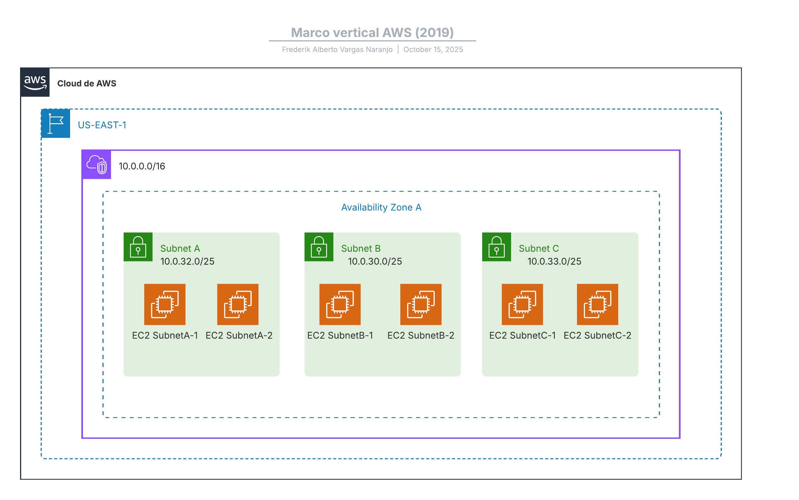

# Ejercicio 2 – VPC con subnets e instancias EC2

Este proyecto crea una **VPC personalizada** con tres subredes y dos instancias EC2 por subred, utilizando **Terraform** en la región `us-east-1`.

## 📦 Recursos creados
- VPC con CIDR `10.0.0.0/16`
- Subred A: `10.0.32.0/25`
- Subred B: `10.0.30.0/23`
- Subred C: `10.0.33.0/28`
- 6 instancias EC2 del tipo `t3.micro` con Amazon Linux 2023
- Todas las subredes están ubicadas en la zona de disponibilidad `us-east-1a`

## 🗺️ Topología
La siguiente imagen muestra la topología creada con LucidChart:



## 📁 Estructura del proyecto
    exercicis/
    └── pt1-3-ex2/
        ├── README.md
        ├── Fitxers Terraform/
        └── assets/
            └── Imatges/
## 🚀 Ejecución
1. Inicializa Terraform:
   ```bash
   terraform init
2. Previsualiza los cambios:
    ```bash
    terraform plan
3. Aplica la infraestructura:
    ```bash
    terraform apply