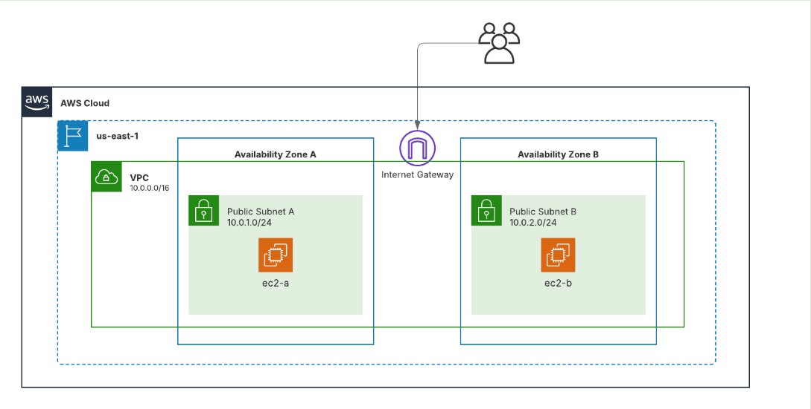

# 🧱 Ejercicio – Infraestructura básica en AWS con Terraform

Este ejercicio despliega una infraestructura básica en AWS utilizando Terraform, cumpliendo los siguientes requisitos:

## 🗺️ Topología
La siguiente imagen muestra la topología creada con LucidChart:



## 🌍 Proveedor y región

- Se utiliza el proveedor oficial de AWS
- Región de despliegue: `us-east-1`

## 🏗️ Recursos creados

- VPC personalizada llamada `VPC-03` con CIDR `10.0.0.0/16`
- 2 subredes públicas:
  - `Public Subnet A` en `us-east-1a` con rango `10.0.1.0/24`
  - `Public Subnet B` en `us-east-1b` con rango `10.0.2.0/24`
- Internet Gateway asociado a la VPC
- Tabla de rutas pública con ruta por defecto (`0.0.0.0/0`) hacia el Internet Gateway
- Asociación de la tabla de rutas a ambas subredes públicas
- Grupo de seguridad que:
  - Permite acceso SSH desde cualquier lugar (`puerto 22`)
  - Permite tráfico ICMP solo desde dentro de la VPC
  - Permite todo el tráfico saliente (IPv4 e IPv6)
- 2 instancias EC2 tipo `t3.micro` con Amazon Linux 2023:
  - `ec2-a` en la subred A
  - `ec2-b` en la subred B
  - Ambas usan el par de claves `vockey` y el grupo de seguridad creado

## 📁 Estructura del proyecto

```plaintext
exercicis/
└── pt1-4-ex1/
    ├── assets/
    │   └── Imatges/
    ├── README.md
    └── main.tf
```

## 🚀 Ejecución
1. Inicializa Terraform:
   ```bash
   terraform init
2. Previsualiza los cambios:
    ```bash
    terraform plan
3. Aplica la infraestructura:
    ```bash
    terraform apply
    ```