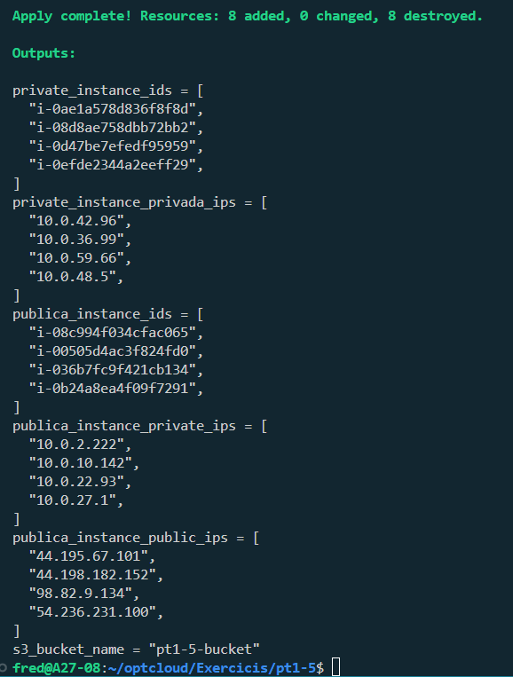
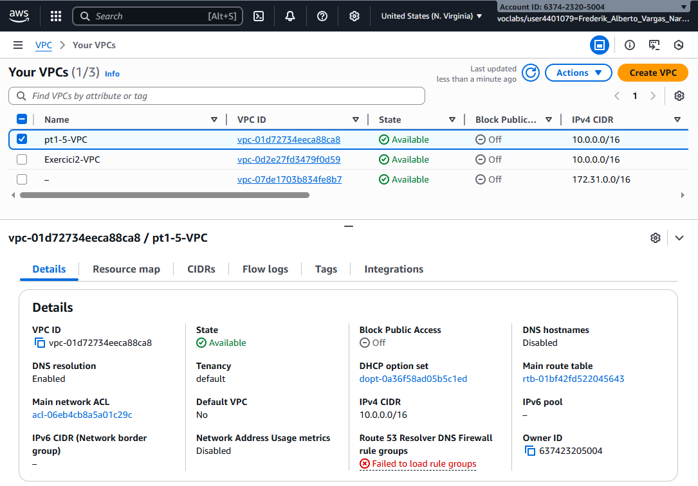
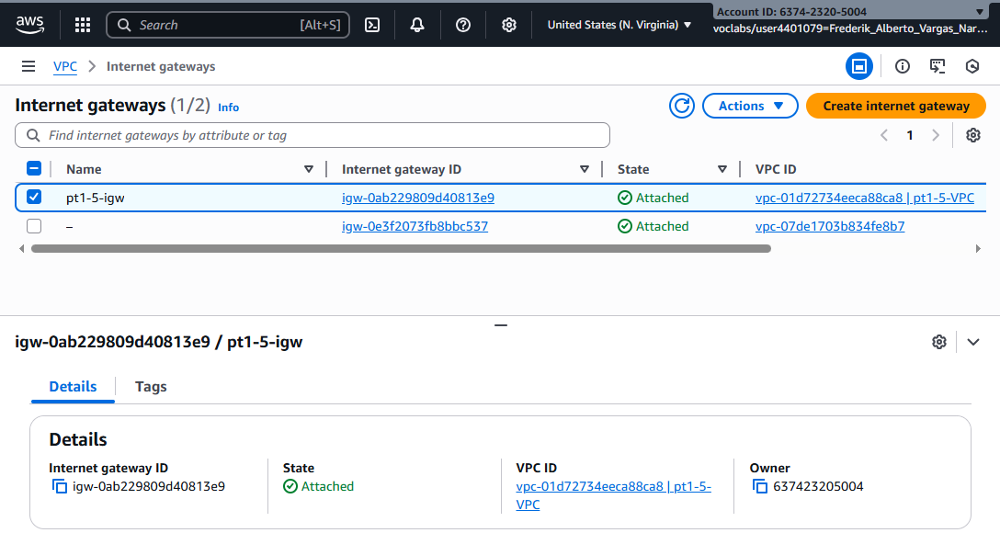
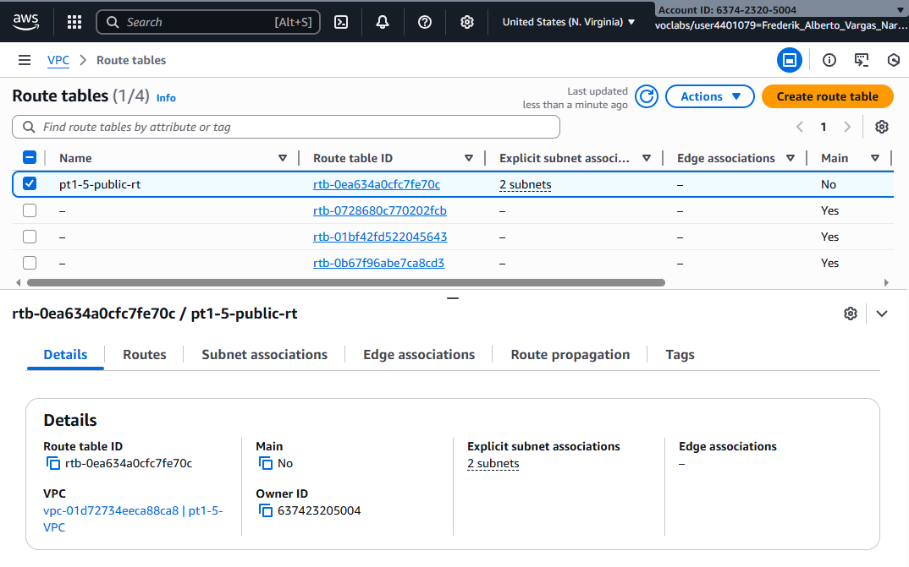
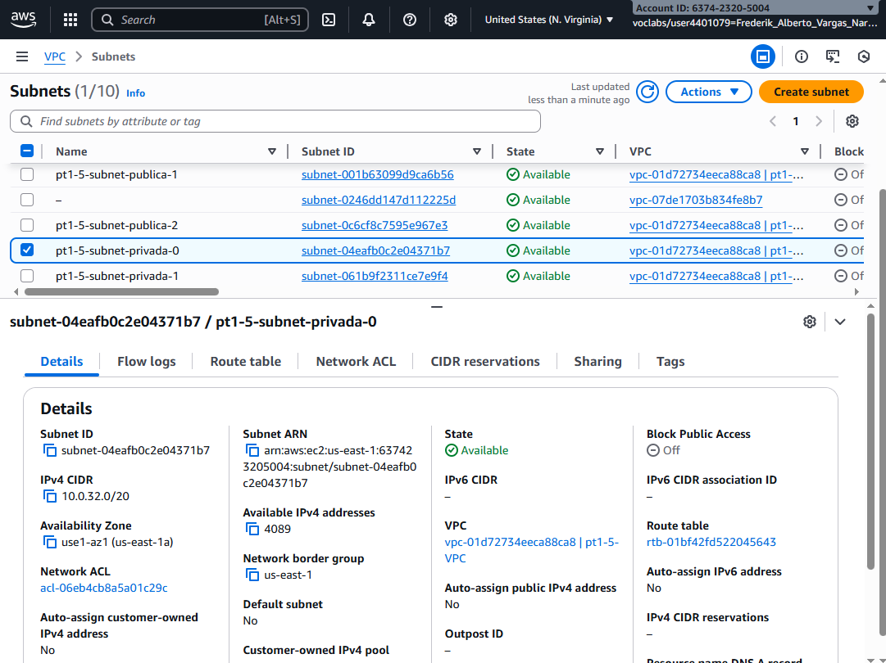
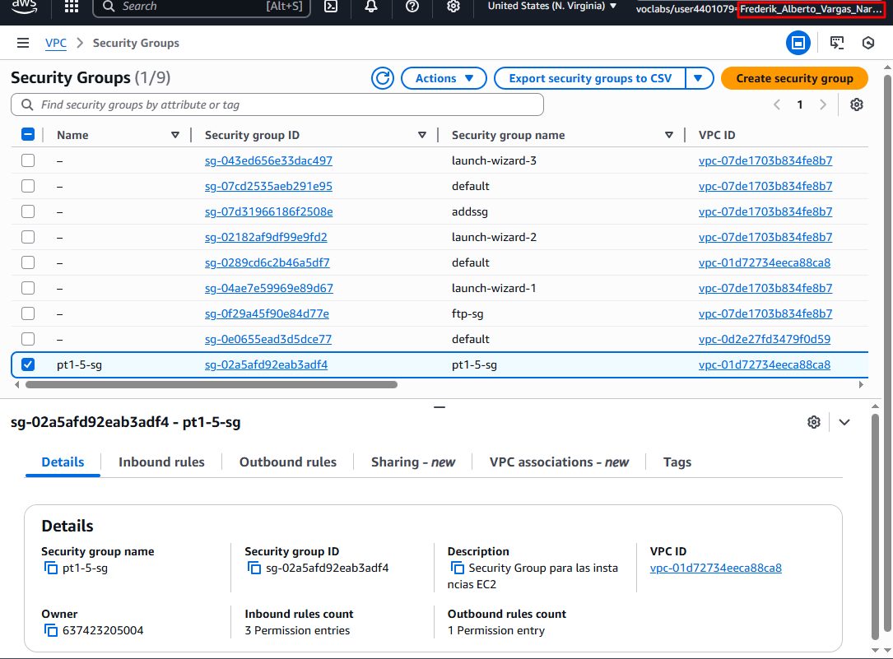
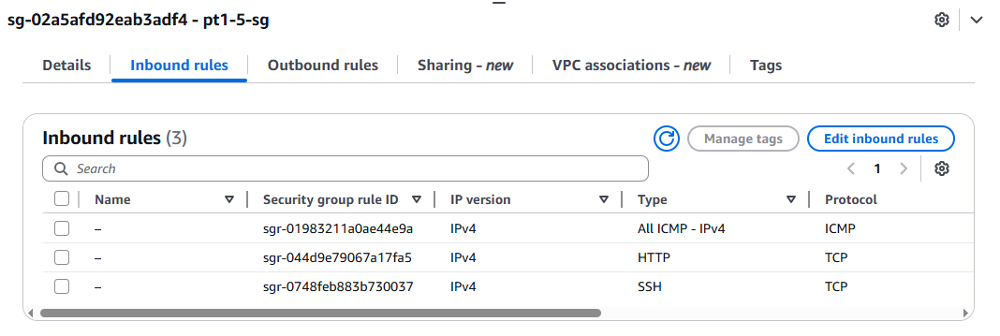
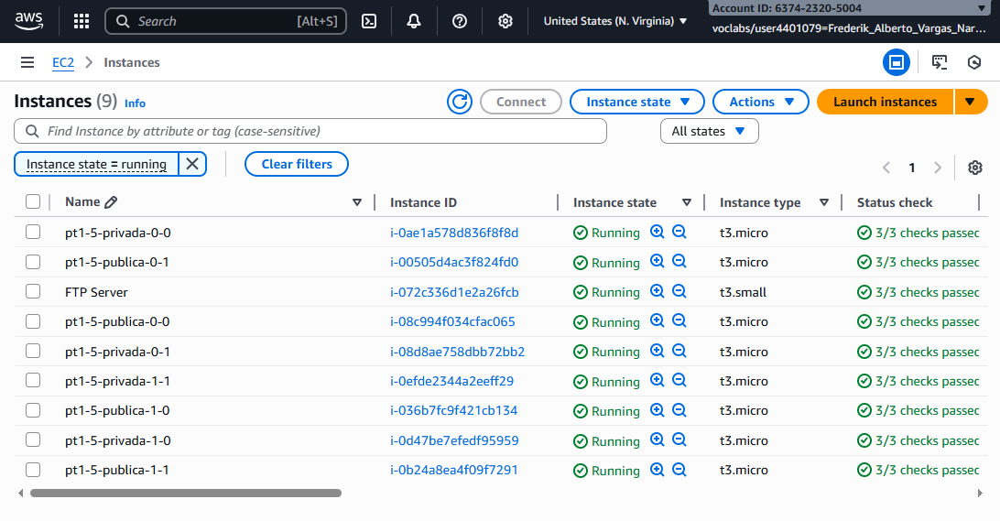

# Infraestructura AWS-Terraform con variables

## 📋 Requisitos Previos

Antes de empezar, asegúrate de que tienes:
* Terraform instalado.
* Credenciales de AWS configuradas (recomendado vía AWS CLI).
* Un editor de código (como VSCode).

---
## 📋 Estructura Github

- **exercicis/**
  - **pt-1-5/**
    - **assets/**
      - Imágenes (opcionales: diagrama de la infraestructura, capturas de pantalla, etc.)
    - `README.md` — Explicación del ejercicio e instrucciones paso a paso
    - `main.tf` — Archivo principal con los recursos de Terraform
    - `variables.tf` — Variables definidas para el ejercicio
    - `outputs.tf` — Outputs definidos para mostrar resultados del despliegue
    - `provider.tf` — Configuración del proveedor AWS


---
## 🛠️ Pasos del Ejercicio

### Paso 1: Configuración Inicial

El primer paso es establecer las bases de nuestro proyecto, definiendo el proveedor y las variables.

#### 1.1. Archivo `provider.tf`
* Crea un archivo `provider.tf`.
* Define el proveedor `aws` y configura su región (`region`) utilizando una variable.

#### 1.2. Archivo `variables.tf`
* Crea un archivo `variables.tf`.
* Define las siguientes variables con sus tipos y, si se indica, valores por defecto:

| Variable | Descripción | Tipo | Valor por Defecto (Sugerido) |
| :--- | :--- | :--- | :--- |
| **`region`** | Región de AWS donde se desplegarán los recursos. | `string` | `us-east-1` |
| **`project_name`** | Nombre del proyecto (se usará para etiquetar). | `string` | `"Fred-1.5"` |
| **`instance_count`** | Define cuántas instancias por subnet. | `number` | `3` |
| **`subnet_count`** | Define cuántas subnets de cada tipo (privada/pública). | `number` | `2` |
| **`instance_type`** | El tipo de instancia (ej: t3.micro). | `string` | `"t3.micro"` |
| **`instance_ami`** | ID de la AMI de AWS para las instancias. | `string` | `ami-052064a798f08f0d3` |
| **`create_s3_bucket`**| Booleano para crear el *bucket* S3 condicionalmente. | `bool` | `true` |
| **`vpc_cidr`** | Bloque CIDR para la VPC (10.0.0.0/16). | `string` | `"10.0.0.0/16"` |
| **`my_ip`** | IP/Red permitida para conexión SSH. | `string` | `"0.0.0.0/0"` |

---

### Paso 2: Red y Subredes

En este paso, construirás la red fundamental.

1.  **Crear una VPC (`aws_vpc`)**:
    * Debe utilizar el bloque CIDR definido en `var.vpc_cidr`.

2.  **Crear Subredes (`aws_subnet`)**:
    * Utilizando `count` o `for_each`, crea el número de subredes públicas especificado en `var.subnet_count`.
    * Utilizando `count` o `for_each`, crea el número de subredes privadas especificado en `var.subnet_count`.
    * *Nota: Asegúrate de que sus bloques CIDR no se solapen.*

3.  **Crear un Internet Gateway (`aws_internet_gateway`)**:
    * Crea el IGW y asócialo a tu VPC.

4.  **Configurar Rutas Públicas**:
    * Crea una Tabla de Rutas (`aws_route_table`) para las subredes públicas.
    * Añade una ruta que dirija todo el tráfico de Internet (`0.0.0.0/0`) hacia el IGW.
    * Asocia esta tabla de rutas a todas las subredes públicas.

---

### Paso 3: Instancias EC2 y Seguridad

Ahora, lanzarás servidores dentro de tu red.

1.  **Crear un Grupo de Seguridad (`aws_security_group`)**:
    * Crea un Security Group asociado a tu VPC que cumpla las siguientes reglas:

    | Tipo | Protocolo | Puerto | Origen | Descripción |
    | :--- | :--- | :--- | :--- | :--- |
    | **Entrada** | TCP | 80 | `0.0.0.0/0` | Permite HTTP desde cualquier IP. |
    | **Entrada** | TCP | 22 | `var.my_ip` | Permite SSH solo desde tu IP. |
    | **Entrada** | ICMP | -1 | `var.vpc_cidr`| Permite ICMP (ping) solo desde dentro de la VPC. |
    | **Salida** | Todos | Todos | `0.0.0.0/0` | Permite todo el tráfico de salida. |

2.  **Crear Instancias EC2 (`aws_instance`)**:
    * Utilizando `count` o `for_each`, lanza las instancias públicas (basado en `var.instance_count`) dentro de las subredes públicas.
    * Utilizando `count` o `for_each`, lanza las instancias privadas (basado en `var.instance_count`) dentro de las subredes privadas.
    * Asigna el Security Group creado a todas las instancias.

---

### Paso 4: Bucket S3 Condicional

En este paso, gestionarás recursos de manera condicional.

1.  **Crear un Bucket S3 (`aws_s3_bucket`)**:
    * Define el recurso para crear un *bucket* S3.
    * Implementa una lógica condicional (p. ej., `count = var.create_s3_bucket ? 1 : 0`) para que el *bucket* **solo** se cree si la variable `create_s3_bucket` está en `true`.

---

### Paso 5: Outputs

Para obtener información útil tras el despliegue, definirás salidas.

1.  **Crear un archivo `outputs.tf`**:
    * Define un *output* que devuelva una lista de las IDs de las instancias, sus IP públicas (si tienen) y sus IP privadas.
    * Define un *output* que devuelva el nombre del *bucket* S3, solo si este se ha creado.

---

### ⭐ Requisitos Adicionales (Buenas Prácticas)

Asegúrate de cumplir con los siguientes requisitos durante todo el ejercicio:

* **Etiquetas (Tags):** Todos los recursos (VPC, subredes, instancias, etc.) deben tener una etiqueta `Name` que incluya el valor de `var.project_name`.
* **Comentarios:** Documenta cada recurso en el código Terraform con un comentario explicativo sobre su función.
* **Dependencias:** Usa `depends_on` explícitamente cuando sea necesario para gestionar dependencias que Terraform no pueda inferir automáticamente (ej: la tabla de rutas depende del IGW).

---

### Paso 6: Ejecución

1. Inicializa Terraform:
   ```bash
   terraform init
2. Previsualiza los cambios:
    ```bash
    terraform plan
3. Aplica la infraestructura:
    ```bash
    terraform apply
    ```
    
---

### Paso 7: Comprobaciones

#### Outputs despues del apply



#### VPC Creado



#### Gateway Creado



#### Tabla Creado



#### Subredes Creadas



#### Security group Creada



#### Subredes Creadas



#### Instancias Creadas

