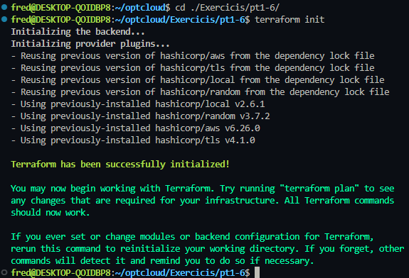
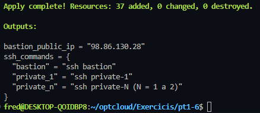
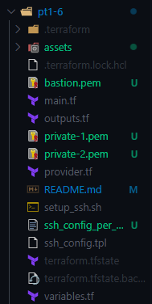
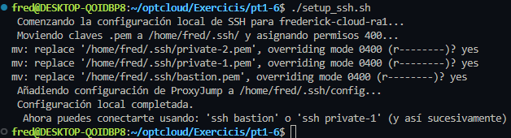
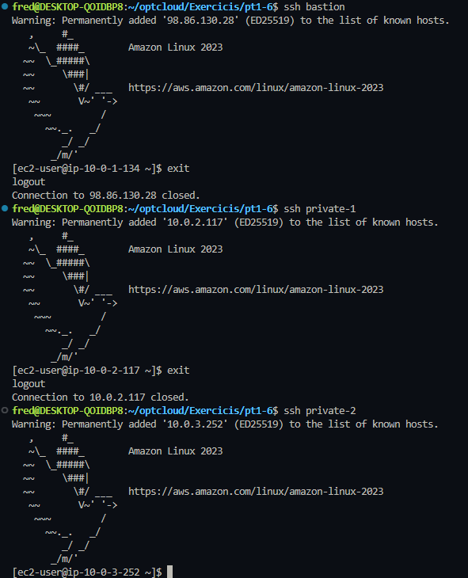
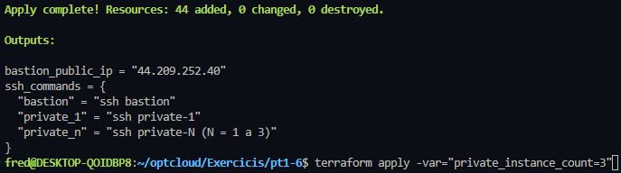
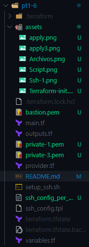
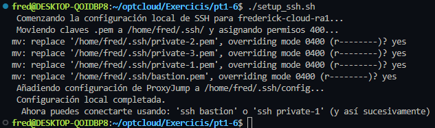
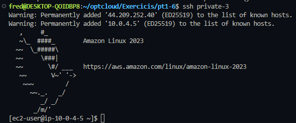

# Despliegue de Arquitectura Cloud Segura en AWS
Este proyecto despliega una infraestructura de red segura y escalable en Amazon Web Services (AWS) utilizando Terraform. La arquitectura se centra en el acceso controlado a recursos privados a través de un Bastion Host y la gestión segura de claves mediante Proxy Jump. 

- Alumno: Frederick Vargas 
- Módulo: OPT: Cloud Computing 
- Control: Pt1.6

## 1. Arquitectura Desplegada
La infraestructura se despliega en la región us-east-1 y sigue un diseño de VPC con subredes públicas y privadas, distribuidas en al menos dos Zonas de Disponibilidad (AZs).

| Componente | CIDR/Nombre | Seguridad y función |
| :--- | :--- | :--- |
| **VPC** | `10.0.0.0/16` | Red principal para aislar los recursos. 
| **Subred Pública** | `10.0.1.0/24` | Aloja el Bastion Host y el NAT Gateway. | 
| **Subredes Privadas (N)** | Calculado (`10.0.2.0/24`, `10.0.3.0/24`, etc.) |Alojan los Servidores Privados; acceden a Internet solo por NAT. |
| **NAT Gateway** | `N/A` | Permite que los servidores privados accedan a Internet saliente. |
| **Bastion Host (EC2)** | `N/A` | Único punto de entrada SSH (Puerto 22) desde tu IP. |
| **Servidores Privados (EC2)** | `private-1`, `private-2`, etc. | Solo aceptan tráfico SSH desde el Security Group del Bastión |
| **S3 Bucket**| `N/A`| Almacena las claves públicas (`.pub`) como copia de seguridad. |

## 2. Variables del proyecto
El despliegue es altamente configurable a través de variables definidas en `variables.tf`. A continuación se detallan todas las variables disponibles y sus valores por defecto:

| Variable | Descripción | Valor por Defecto |
| :--- | :--- | :--- |
| `aws_region` | Región de AWS donde se desplegará la infraestructura. | `us-east-1` |
| `project_name` | Prefijo utilizado para nombrar y etiquetar los recursos. | `frederick-cloud` |
| `vpc_cidr_block` | Bloque CIDR principal para la VPC. | `10.0.0.0/16` |
| `public_subnet_cidr_base` | Bloque CIDR asignado a la subred pública. | `10.0.1.0/24` |
| `private_instance_count` | Número de servidores privados a desplegar (N). | `2` |
| `allowed_ip` | Dirección IP o CIDR permitido para acceso SSH al Bastion. | `0.0.0.0/0` |
| `ami_id` | ID de la AMI a utilizar (Ubuntu Server 22.04 LTS). | `ami-052064a798f08f0d3` |
| `instance_type` | Tipo de instancia EC2 para el Bastion y los servidores privados. | `t2.micro` |

**Ejemplo de Despliegue modificando variables:**

```bash
terraform apply -var="private_instance_count=3"
```

## 3. Guía de Uso 🚀

### 3.1. Despliegue de la Infraestructura

1.  **Inicializar Terraform:**
    Descarga los proveedores y prepara el entorno.
    ```bash
    terraform init
    ```

2.  **Planificar y Aplicar:**
    Despliega la infraestructura en AWS.
    ```bash
    terraform apply
    ```

### 3.2. Configuración de Acceso Local (Post-Apply)

Una vez finalizado el `terraform apply`, se generan automáticamente las claves privadas (`.pem`) y el archivo de configuración SSH. Ejecuta el script `setup_ssh.sh` para automatizar la configuración del Proxy Jump:

1.  **Dar Permisos al Script:**
    ```bash
    chmod +x setup_ssh.sh
    ```

2.  **Ejecutar el Script:**
    ```bash
    ./setup_ssh.sh
    ```
    
    Este script realiza las siguientes acciones automáticamente:
    * Mueve las claves `.pem` a `~/.ssh/`.
    * Asigna los permisos seguros (`chmod 400`).
    * Añade la configuración de ProxyJump a tu archivo `~/.ssh/config`.

### 3.3. Conexión Remota Segura (Proxy Jump)

Una vez configurado, el acceso a las máquinas privadas es transparente a través del Bastion Host[cite: 83].

| Destino | Comando SSH | Método |
| :--- | :--- | :--- |
| **Bastion Host** | `ssh bastion` | Conexión directa. |
| **Servidor Privado 1** | `ssh private-1` | **ProxyJump** (a través del Bastion). |
| **Servidor Privado N** | `ssh private-N` | **ProxyJump** (a través del Bastion). |

### 3.4. Limpieza (Destruir Infraestructura)

Para destruir todos los recursos y evitar costos innecesarios, ejecuta el siguiente comando. **Importante:** Asegúrate de usar el mismo valor de `private_instance_count` que usaste al crear la infraestructura.

```bash
terraform destroy -var="private_instance_count=N" # Reemplaza N con el número que usaste en el apply.
```

## 4. Comprobaciones

### 4.1 Comprobaciones sin cambiar la variable en el cmd:

Primero vamos al directorio correspondiente y utilizamos un Terraform init.



Hacemos un `apply` y si todo sale bien nos aparecera esto:



Esto son los archivos que nos aparecera despues del `apply`



Utilizamos el `script` que creamos, la primera vez no te preguntara nada pero como he hecho pruebas te pedria si quieres removerlo, en este caso ponemos yes ya que si no pones nada no se sobrescribira:



Ahora podremos hacer SSH a cualquiera de las 3 maquinas que tenemos.



### 4.2 Comprobaciones cambiando la variable en el cmd:

Para esto utilizaremos el siguiente comando que hara que cree 3 instancias privadas en vez de 2.




Si vemos ahora los archivos veremos que habra otro `.pem`:



Si utilizamos el `script` veremos que nos pedira remplazar todo ya que hice esta comprobacion tambien antes pero si no estan estos archivos no te pediria de remplazarlos.



Solo pondre la prueba de que me puedo conectar a la 3, ya que en la otra comprobacion lo hago con las otras maquinas, veremos que tendremos todo bien. Oleeeee!

